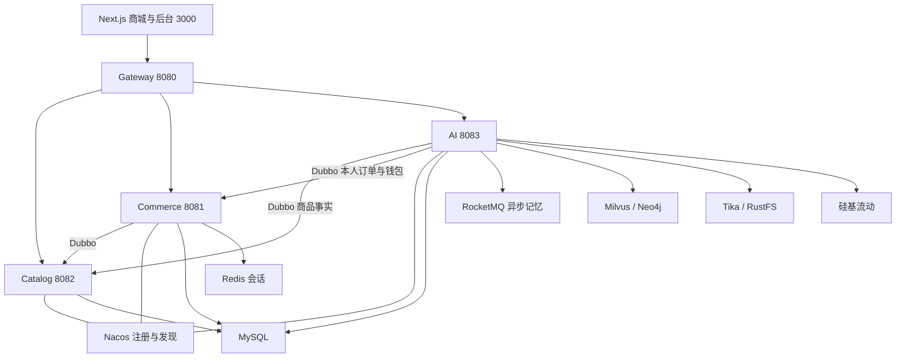

# 比特严选 · Bit Select

面向电子产品与生活用品的本地演示电商平台，包含 200 个商品、完整余额交易流程，以及能检索说明书、记住用户偏好、读取实时商品和本人订单的 AI 导购助手。

[实施决策与进度](docs/实施决策与进度.md) · [AI 实现与验收](docs/AI实现与验收.md) · [接口契约](backend/API-CONTRACT.md) · [原始项目书](docs/比特严选项目书-v0.1-评审稿.md)

采用 Next.js、TypeScript、Ant Design、Java 21、Spring Boot 3、Spring Cloud Gateway / Sentinel、Dubbo、Nacos、Spring AI Alibaba、MySQL、Redis、RocketMQ、Milvus、Neo4j、Tika、RustFS 与 Docker。业务代码在 Windows / IDEA 运行，全部中间件在 WSL Ubuntu 的 Docker 中运行。

## 应用结构



四个 Java 应用通过 Nacos / Dubbo 协作。交易服务集中管理账户、钱包、库存、订单、地址和售后；所有服务当前共用 `bit_select` schema，按职责分表。订单、库存和钱包的强一致操作在单个 MySQL 事务内完成，异步事件使用数据库任务/Outbox 与 RocketMQ。

Java 侧锁定 Spring Boot 3.5.11、Spring Cloud 2025.0.2、Dubbo 3.3.5、Spring AI Alibaba Graph Core 1.1.2.2；前端锁定 Next.js 16.3.6、React 19.2.4、Ant Design 6.6.5。AI StateGraph 编排重写、分类和检索，模型兼容接口由 Java HTTP 客户端调用。

## 运行环境

- Windows 11、WSL 2 Ubuntu、Docker Engine 与 Docker Compose。
- JDK 21、Maven 3.9+、Node.js 24、PowerShell 7、Python 3.12+。
- 本机 16 GB 内存、WSL 当前上限约 7.4 GiB；使用分阶段启动和开发容量配置，不修改用户的 WSL 全局限制。

从仓库根目录执行：

```powershell
# 首次自动生成 infra/.env 的随机密码；已有配置会保留
pwsh ./scripts/Start-LocalInfrastructure.ps1 -Profile core
# 增加 AI 依赖
pwsh ./scripts/Start-LocalInfrastructure.ps1 -Profile ai
# 再增加 Sentinel 控制台
pwsh ./scripts/Start-LocalInfrastructure.ps1 -Profile full
pwsh ./scripts/Test-LocalInfrastructure.ps1 -Profile full
```

详细端口、数据卷、资源限制和停止方式见 [中间件说明](infra/README.md)。所有容器采用独立 `bit-select` 项目和持久卷，默认仅绑定本地回环地址。启动脚本会保留一个隐藏 WSL 进程，避免仅有 systemd 服务时 WSL 自动退出；停止脚本会关闭本项目保活进程。

## 私密配置

中间件密码与本地管理员初始密码保存在 `infra/.env`。硅基流动参数放在根目录 `.env.local`，不要写入源码、PR、提交或截图：

```dotenv
SILICONFLOW_API_KEY=填写你自己的密钥
SILICONFLOW_BASE_URL=https://api.siliconflow.cn/v1
SILICONFLOW_CHAT_MODEL=Qwen/Qwen3-30B-A3B-Instruct-2507
SILICONFLOW_EMBEDDING_MODEL=Qwen/Qwen3-Embedding-4B
SILICONFLOW_RERANK_MODEL=Qwen/Qwen3-Reranker-4B
AI_CONTEXT_TOKENS=262144
```

在启动应用的 PowerShell 中执行 `. ./scripts/Use-LocalEnvironment.ps1`，只给当前进程加载配置。IDEA 使用下面的脚本生成启动项，直接读取本地环境文件；无需复制凭证到运行配置。没有提供有效 API Key 时，涉及模型的接口应明确报告未配置。

对话模型按 256K 容量配置为 262,144 token；Embedding 实际为 2,560 维。上下文在 60% 时触发较早历史摘要，最近约 20% 按完整轮次保留。正文使用真实 Qwen tokenizer，消息封装估计、回答输出和安全余量单独预留，本地估计不等同于供应商最终 usage。具体规则和模型切换影响见 [AI 实现](docs/AI实现与验收.md)。

## 启动应用

先启动中间件，再构建业务代码。在 IDEA 2025.3 或更新版本打开**仓库根目录**，导入 `backend/pom.xml` 为 Maven 项目，设置项目 SDK 与 Maven JDK 均为 Java 21。首次安装前端依赖执行 `npm --prefix web ci`。执行以下脚本生成或更新本地运行配置：

```powershell
pwsh ./scripts/New-IdeaRunConfigurations.ps1
```

脚本识别本机 JDK 21 与 Node.js，生成以下七个运行项。可用 `-JavaHome` 和 `-NodeInterpreter` 显式指定安装路径。默认只刷新这七项，其他运行项保留。

| IDEA 运行项 | 用途 | HTTP 端口 |
| --- | --- | --- |
| `Bit Select - catalog-service` | 商品与知识文档目录 | 8082 |
| `Bit Select - commerce-service` | 用户、钱包、订单、售后 | 8081 |
| `Bit Select - ai-service` | AI 导购、检索和记忆 | 8083 |
| `Bit Select - gateway` | API 网关 | 8080 |
| `Bit Select - web` | Next.js 开发服务 | 3000 |
| `Bit Select - 全部后端` | 并行启动四个 Java 服务 | — |
| `Bit Select - 全部应用` | 并行启动后端与前端 | — |

后端运行项通过 IDEA **原生环境文件支持**依次读取 `infra/.env`、根目录 `.env.local`（存在时），后者同名变量优先；不需要安装 `.env` 插件。启动时读取文件，修改已有文件的密码或模型密钥后只需重新运行相应服务。若之后才新建 `.env.local`，重新运行生成脚本添加引用。配置只保存文件路径，不保存密码或 API Key，整个 `.idea/` 被 Git 忽略。前端运行项仅设置网关地址，执行 `npm run dev -- --port 3000` 固定端口，Next.js 自行读取 `web/.env.local`，不会加载后端模型密钥。

在 IDEA 停止原来的服务和前端进程，再从右上角选择 `Bit Select - 全部应用`，点击运行或调试。若运行列表尚未刷新，使用“文件 → 从磁盘重新加载所有文件”（或重新打开项目）。选择名称以 `Bit Select -` 开头的配置；IDEA 自动创建的 `AiApplication` 等临时配置不会自动继承这些环境文件设置。单独启动时，按 Catalog、Commerce、AI、Gateway、Web 的顺序运行；组合启动并行运行，等待所有服务就绪后访问商城。

如果要继续使用已有的 `AiApplication`、`CatalogApplication`、`CommerceApplication`、`GatewayApplication` 启动项，先在 IDEA 关闭本项目，再执行：

```powershell
pwsh ./scripts/New-IdeaRunConfigurations.ps1 -UpdateExistingConfigurations
```

然后重新打开项目，重新启动服务。该选项按 Spring Boot 配置类型、主类和模块匹配本项目的已有运行项，补齐环境文件、工作目录、数据路径和端口，保留 VM 参数、调试设置及其他个人配置。原始 `workspace.xml` 首次修改前备份在 `.local/idea-workspace.before-run-fix.xml`。关闭项目是为了避免 IDEA 用内存中的旧设置覆盖修改。以后新增其他运行项时，需要再次补齐；修改磁盘配置不会改变已经启动的 Java 进程。

IDEA 配置中的 `$PROJECT_DIR$` 必须指向仓库根目录，以便找到 `data/products.json` 和 `data/ranking/model.json`。如果已有项目将 `backend` 作为根目录，请重新在 IDEA 打开仓库根目录。业务应用由 IDEA 运行，中间件继续运行在 WSL Docker。

也可直接通过 Windows 后台进程运行同一套 Java 21 应用：

```powershell
# 初次安装前端依赖
npm --prefix web ci
# 构建和测试后端，隐藏启动四个 Java 进程与前端
pwsh ./scripts/Start-Application.ps1 -Build -Frontend
# 仅启动商城，不启动 AI
pwsh ./scripts/Start-Application.ps1 -SkipAi -Frontend
# 只停止启动脚本登记且通过 PID、启动时间、路径核验的本项目进程
pwsh ./scripts/Stop-Application.ps1
```

启动脚本优先使用 `JAVA_HOME` 中的 Java 21，也能发现当前用户 `.jdks` 下的 JDK 21；可通过 `-JavaHome` 显式指定。运行时将 JAR 复制到 `.local/runtime`，避免 Windows 锁住 Maven `target` 输出影响后续构建。日志位于 `.local/logs`，进程登记位于 `.local/application-processes.json`。若端口被未登记的 IDEA 或其他应用占用，脚本明确停止启动，不会杀掉该进程。前端生产模式先执行 `npm --prefix web run build`，再使用 `-Frontend -FrontendMode production`。

| 入口 | 地址 | 用途 |
| --- | --- | --- |
| 商城 | <http://localhost:3000> | 200 个演示商品、搜索、分类、商品详情 |
| AI 导购 | <http://localhost:3000/assistant> | 对话、商品知识引用、检索与记忆状态 |
| 账户 | <http://localhost:3000/account> | 钱包、地址与账户信息 |
| 订单 | <http://localhost:3000/orders> | 支付、取消、确认收货与售后 |
| 管理后台 | <http://localhost:3000/admin> | 管理员分配余额、商品库存、发货与售后审核 |
| API 网关 | `127.0.0.1:8080` | 前端唯一业务入口 |

| 本地中间件 | 默认端口 |
| --- | --- |
| MySQL / Redis | `13306` / `16379` |
| Nacos HTTP / gRPC | `18848` / `19848` |
| Sentinel Dashboard | `18880` |
| RocketMQ Namesrv / Broker / VIP | `19876` / `20911` / `20909` |
| RustFS S3 / 控制台 | `19000` / `19001` |
| Milvus / 健康检查 | `19530` / `19091` |
| Neo4j HTTP / Bolt | `17474` / `17687` |
| Tika | `19998` |
| etcd | Compose 网络内部，不映射宿主机 |

业务 HTTP 绑定 `127.0.0.1`；Dubbo 在 `::1` 回环运行，Catalog / Commerce 使用 `20882` / `20881`，AI 配置 `20883`。本地需要启用 IPv6 回环。服务端口可由环境变量覆盖，Nacos gRPC 和 RocketMQ 注册地址须按 [中间件说明](infra/README.md) 同步调整。

管理员账号默认 `admin`，初始密码在本机 `infra/.env` 的 `ADMIN_PASSWORD`，由首次初始化随机生成。普通用户注册后余额为 0，需要管理员分配演示余额。所有金额使用整数分；钱包、库存、订单位于同一交易微服务，以数据库事务和幂等键约束重复操作。登录凭证在 Redis 保存七天，每次认证刷新有效期。接口与订单状态机见 [接口契约](backend/API-CONTRACT.md)。

首次演示可先注册普通用户，再用管理员分配余额，购买、支付、发货、确认收货并申请售后；未支付订单 15 分钟后自动取消并释放库存。后台还有商品上下架、库存幂等调整和退货验收。此余额与物流均为本地模拟。

## 初始化知识库与使用导购

200 个原创虚拟商品分成六类：数码配件 40 个、电脑办公 35 个、音频智能 25 个、小家电 35 个、厨房 35 个、家居出行 30 个。配套说明书在 `data/manuals`，商品外观使用本地 SVG。它们不是其他商家的真实商品或官方手册。

管理员进入后台“知识库”，点击“同步知识库”。系统把原件存入 RustFS，经 Tika 解析与二次清理、语义切块、两侧各最多 200 Qwen token 延伸、Embedding 后存入 Milvus。页面显示真实进度，失败可再次同步；不变的 READY 文档跳过。本机已经验收 200 个 READY 文档、400 个片段，新环境仍需执行此步骤。首次入库会产生模型调用费用。

导购采用问题重写、意图识别、BM25 与 COSINE 各 Top 10、Qwen Reranker、实际 LambdaMART Top 5，并读取当前商品价格、库存、预算及本人订单/钱包。推荐最多三款商品，并按具体商品 ID 检索各自说明书，每款最多两个片段，防止不同型号混用参数。引用与完整答案随会话保存。长期记忆通过 RocketMQ 异步写 MySQL，并投影至 Milvus / Neo4j；支持个人隔离、去重、冲突处理、停用与删除。

默认 LambdaMART 使用 200 个商品指向查询的真实检索特征训练，标签为目录规则弱标注，留出集 NDCG@5 为 0.979061，Reranker 基线为 0.962848。该任务有品类限制及商品身份特征，**不能据此宣称开放式导购质量提升**。原始数据、制品、指标和限制见 [训练说明](data/ranking/README.md)。AI 只读取业务事实，付款和退款由用户在交易页面明确操作。

## 验证与协作

```powershell
. ./scripts/Use-LocalEnvironment.ps1
python scripts/test-ai-infrastructure.py
python scripts/smoke-test.py
python scripts/real-concurrency-test.py
# AI 认证、归属、记忆开关；不调用模型
python scripts/ai-smoke-test.py
# 真实付费模型、引用、预算与 RocketMQ 记忆验收
python scripts/ai-smoke-test.py --with-model --with-worker
```

AI 中间件验证真实执行 RustFS 签名上传/下载、Tika 中文解析、Neo4j 事务、Milvus 向量插入与余弦检索，不调用付费模型；只清理脚本自己创建的临时资源。`smoke-test.py` 验证真实 HTTP 交易链路，测试用户和审计记录保留。AI 默认验收打印 SKIP 的付费部分不算通过，完整覆盖需显式添加上述参数。

并发验证创建独立的测试商品和用户，真实检查双用户抢最后一件库存、同余额并发支付不同订单、同一订单并发支付只扣款一次；结束后下架测试商品，保留交易审计记录。离线学习排序的标签来源、无泄漏切分与质量限制见 [LambdaMART 训练说明](data/ranking/README.md)。

每一项较大功能从最新 `main` 新建分支，提交并推送到 GitHub，经中文 PR 与 CI 验证通过后再合并。PR 和 commit 标题统一格式：`feat:add product catalog/新增商品目录` 或 `fix:fix a bug/修改一个错误`。CI 在组件实际加入仓库后执行对应的 Java 测试、前端测试与构建、Compose 校验和真实交易集成；不会将尚未提交的组件当作已经通过验证。

CI 保留后端 JAR、测试报告、Next.js 构建和集成日志。真实集成启动 MySQL、Redis、Nacos、RocketMQ 与四个 Java 服务，执行交易、并发和 AI 权限隔离脚本；AI 算法测试不需要密钥，付费模型及 AI 存储的完整联调在本机运行。排序数据、报告和模型指纹也在 CI 校验。没有配置生产服务器自动发布。状态见 [GitHub Actions](https://github.com/yin-bo-Final/Bit-Select/actions)。

停止应用使用 `Stop-Application.ps1`，停止中间件使用 `Stop-LocalInfrastructure.ps1`，均保留数据。不要用删除卷的方式重启项目。模型或存储异常时先看 `.local/logs`、容器健康及后台知识库状态；密钥只在本地配置修正，不粘贴到 issue 或日志。

开发环境采用单实例数据库和中间件，面向功能演示，未声称生产高可用或完成容量压测。没有真实支付、物流、短信注册及商品安全认证；AI 检索投影最终一致，生成结果仍可能错误。具体已验证范围与未覆盖边界见 [实施记录](docs/实施决策与进度.md) 和 [AI 验收](docs/AI实现与验收.md)。
