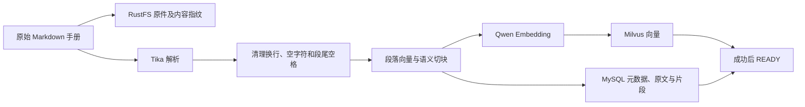
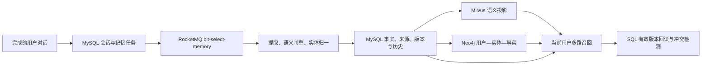

# 比特导购：AI 实现与验收

更新日期：2026-09-27。本文以当前源码和实际本地数据为依据；接口总表见 [API 契约](../backend/API-CONTRACT.md)，启动见 [README](../README.md)。

最终本机真实验收已通过：硅基流动流式推荐、300 元预算追问、逐 SKU 引用与刷新持久化、跨用户会话拒绝、RocketMQ 记忆写入、关闭与删除。两条实际长期记忆的 MySQL、Milvus 与 Neo4j 投影版本、用户归属和实体关系已核对一致。消息时间与 UTC 校验差值不足 1 秒，本地展示为上海时间。付费调用不放入无密钥 CI。

## 模型与调用边界

| 用途 | 硅基流动模型 ID | 当前配置 |
| --- | --- | --- |
| 对话、摘要、重写、意图与记忆判断 | `Qwen/Qwen3-30B-A3B-Instruct-2507` | 容量按 256K 即 262,144 token 配置，单次流式回答最多 2,048 token |
| 语义边界与知识、记忆向量 | `Qwen/Qwen3-Embedding-4B` | 实际向量维度 2,560；更换维度需要新建 collection 并重建索引 |
| 候选重排 | `Qwen/Qwen3-Reranker-4B` | 对 BM25 与向量召回的候选并集评分 |

使用 `https://api.siliconflow.cn/v1`；模型和密钥从环境加载。供应商账号可用模型列表、真实 Embedding 维度及真实重排、对话调用已核验。模型原始说明见 [Qwen 官方模型页](https://huggingface.co/Qwen/Qwen3-30B-A3B-Instruct-2507)。供应商可能调整服务限制，`AI_CONTEXT_TOKENS` 是可覆盖的应用预算；262,144 不是本项目通过满容量长请求压测得到的值。

[AiWorkflow](../backend/ai-service/src/main/java/com/bitselect/ai/AiWorkflow.java) 使用 Spring AI Alibaba StateGraph 串联重写、意图识别与检索；[SiliconFlowClient](../backend/ai-service/src/main/java/com/bitselect/ai/SiliconFlowClient.java) 使用 Java HTTP 客户端对接 chat、embeddings、rerank。提示词独立保存在 [prompts](../prompts)，打包到 AI 服务资源中，覆盖导购约束、重写、分类、摘要、提取、语义判重及冲突选择。

AI 可读取实时商品、当前用户订单和钱包。支付、退款、管理员充值仍走业务接口及明确的用户操作，模型没有这些写入工具。

## 200 个商品与知识入库

商品清单位于 [data/products.json](../data/products.json)，原始说明书位于 [data/manuals](../data/manuals)。前端携带对应商品 SVG 与说明书副本。全部为原创虚拟演示商品，不表示京东京造或其他品牌的真实产品、认证与售后承诺。

| 分类 | 数量 |
| --- | ---: |
| 数码配件 | 40 |
| 电脑与办公 | 35 |
| 音频与智能 | 25 |
| 生活小家电 | 35 |
| 厨房与餐饮 | 35 |
| 家居与出行 | 30 |
| 合计 | 200 |

实际链路由 [KnowledgeService](../backend/ai-service/src/main/java/com/bitselect/ai/KnowledgeService.java) 执行：



原件通过 AWS SigV4 / path-style S3 写入 `bit-select-documents`；Milvus 自身使用独立的 `bit-select-milvus` 桶。内容指纹包含切块版本 `qwen-token-boundaries-v2`，READY 且指纹相同的手册跳过。当前知识 collection 为 `bit_knowledge_qwen4b_v2`。

[SemanticChunker](../backend/ai-service/src/main/java/com/bitselect/ai/SemanticChunker.java) 保留段落完整性：正文通常围绕 600–1,000 token 组织，累积超过 600 后遇标题或相邻段落余弦相似度低于 0.66 可以切分；加入下一段将超过 1,000 时也选择边界。整段自身过长时仍保留整段，因此 1,000 是目标长度，不是任意输入的硬上限。切点左右各扩展至多 200 个实际 Qwen token，文档端点自然截断，Unicode 按完整码点移动。

MySQL 保存原文、hash、商品关联、标题、正文、偏移和 embedding JSON；Milvus 保存向量及商品/文档 ID。失败标记 FAILED 并保存错误类别，再次“同步知识库”可重试；同 JVM 内防止并行重复入库。只有 READY 文档进入检索。

本机核验结果为 **200 个 READY 文档、400 个片段**，来自实际数据库。新环境需要管理员在后台知识库页启动同步，界面显示文档状态、片段数、错误和更新时间。同步会产生模型调用费用。

正式验证的输入是这 200 份 Markdown 文本。Tika 的格式能力不等于应用已验证任意上传、扫描件 OCR、恶意文件隔离和分布式导入任务。RustFS/Milvus/MySQL 之间没有分布式原子事务；状态、重试及过滤处理演示范围内的失败。

## 查询、混合召回与排序

1. 读取当前用户会话与有效记忆，重写问题，识别 `recommend / compare / manual / order / wallet / general` 意图。
2. 商品知识问题使用 BM25 从 READY 片段召回 Top 10，同时用 Qwen 查询向量在 Milvus 按 COSINE 召回 Top 10；合并片段 ID，候选通常不超过 20 条。
3. Qwen Reranker 为并集打分。四个特征依次传入 LambdaMART：`bm25Score, cosineScore, rerankScore, exactProductMatch`，普通知识问题返回 Top 5；针对最多三款商品的推荐或比较，按明确 productId 限定两路检索，每款最多保留两个片段，保证各款证据独立。LambdaMART 同分时依次使用重排分、余弦分和片段 ID 稳定排序。
4. 推荐/比较同时调用 CatalogRpc 查询当前在售、库存与预算内商品；订单和钱包意图调用带当前用户身份的 CommerceReadRpc。服务器按整数分核算并转换为人民币元，过期手册不能决定余额或实时售价。
5. 证据、有效记忆和会话共同用于生成；完成后保存答案与引用，刷新会话仍可查看相同来源。

实现见 [RetrievalService](../backend/ai-service/src/main/java/com/bitselect/ai/RetrievalService.java)、[Bm25](../backend/ai-service/src/main/java/com/bitselect/ai/Bm25.java)、[BudgetFacts](../backend/ai-service/src/main/java/com/bitselect/ai/BudgetFacts.java)。BM25 使用中文单字/双字和英文词项，当前 400 个片段在应用侧计算，没有独立全文检索集群。向量未召回的稀疏候选，其 dense 特征为 0，不代表重新计算了全量余弦分数。

### LambdaMART 制品与评测

[data/export_ranking.py](../data/export_ranking.py) 导出 200 个自动商品指向查询的 2,364 条真实候选，使用当前语料 BM25、真实 Qwen Embedding 与真实 Qwen Reranker。每个查询在其互斥品类池中召回，避免训练与测试通过同一商品泄漏。

标签来源为 `catalog-target`：目标商品 3、同类型商品 1、其余 0，没有人工评审。训练按 query/product 二部图连通组划分，特征、来源和数据 SHA-256 写入报告。训练为 4 个品类的 135 个查询，验证为 living 的 30 个查询，测试为 office 的 35 个查询。测试集不参与提前停止。

LightGBM 4.6.0 的 `lambdarank` 提前停止实际选择 **1 棵树**，没有为展示效果人为增加树数。[model.json](../data/ranking/model.json) 是实际 LightGBM dump，Java [LambdaMartRanker](../backend/ai-service/src/main/java/com/bitselect/ai/LambdaMartRanker.java) 按数字 `<=` 节点遍历并对树求和。模型文件缺失时回退 Reranker，模式标为 `RERANK_BASELINE`；正常加载为 `LAMBDAMART`。

| 留出指标 | LambdaMART | Reranker 基线 | 差值 |
| --- | ---: | ---: | ---: |
| NDCG@5 | 0.9790607343 | 0.9628481550 | +0.0162125793 |
| NDCG@10 | 0.9813916650 | 0.9420527600 | +0.0393389050 |

结果只描述当前弱标注商品指向任务，不能证明真实用户的开放式导购质量提升。查询包含商品身份、候选限制在单个品类、`exactProductMatch` 与目标标签高度相关，任务较容易。需要独立人工标签、跨品类真实查询和线上反馈才能评价泛化效果。

复现见 [训练说明](../data/ranking/README.md)。[evaluation.json](../data/ranking/evaluation.json) 与 [export-report.json](../data/ranking/export-report.json) 记录来源；[equivalence-fixtures.json](../data/ranking/equivalence-fixtures.json) 的预期分数由原生 LightGBM 生成，包含阈值边界，供 Java 数值一致性校验。`fixtures` 下的合成数据不用作默认模型或质量证据。

## 短期记忆与 Token 预算

三个概念分别处理：

- **容量配置**：`AI_CONTEXT_TOKENS=262144` 表示应用按所选模型 256K 容量控制请求。更换模型或供应商后需重新核实。
- **正文计数**：[QwenTokens](../backend/ai-service/src/main/java/com/bitselect/ai/QwenTokens.java) 使用 Qwen 官方模型 ByteLevel BPE 词表和预切分表达式，转换后随 JAR 打包，不用中文字数或其他模型的 tokenizer 替代。来源、许可和 SHA-256 在 [data/tokenizer](../data/tokenizer)。
- **包络与余量**：每条消息另估算 8 token，整次请求再预留 4,096 token，覆盖 2,048 输出上限和安全余量。聊天模板、角色封装由供应商决定，这部分不是逐项精确复刻；不能宣称本地计数与 API usage 完全相同。

[ContextWindow](../backend/ai-service/src/main/java/com/bitselect/ai/ContextWindow.java) 和 [ConversationStore](../backend/ai-service/src/main/java/com/bitselect/ai/ConversationStore.java) 将同一 `turn_id` 的 user/assistant 视为整轮。固定预算包括系统提示、已有摘要、当前问题、证据和预留；总量达到容量 60% 时，摘要较早历史，保留从最新消息倒推的约 20% 容量。

在 262,144 配置下，触发比较值为 `floor(262144 × 0.60) = 157286`，保留目标约 52,429 token。边界若落在第 7.4 轮，则保留完整 8 轮，摘要其余更早轮次。窗口可因整轮扩展超过 20%，不截断提问与回答的配对关系；只有一轮时也不为阈值拆开它。

摘要请求使用独立提示词和 1,200 token 输出预算；数据库保留完整历史，只更新摘要、覆盖到的消息 ID 与版本。最终组装请求再次计数，超过安全容量时明确拒绝，要求缩小问题或开启新会话。

压缩边界与正文计数有测试，其中中文、Unicode、长文本和手册样本与上游 Hugging Face Tokenizers fixture 对照。**没有执行 262,144 token 满窗口付费压测**；容量配置及算法测试不能当作满载可用性、延迟或成本承诺。

## 长期记忆：主存储、投影与冲突

提取用户表达的稳定偏好和习惯，不把每条对话直接当事实。成功对话与记忆任务在同一个 MySQL 事务保存，任务仅包含用户输入；记忆开关关闭时不创建新任务。



实现集中于 [MemoryService](../backend/ai-service/src/main/java/com/bitselect/ai/MemoryService.java)：

- 数据库任务发布到 RocketMQ；消费者按任务状态与来源顺序处理重复及延迟消息。失败保留并在超时后重试；应用任务尝试上限为 8 次，持续失败需要运维介入。
- 每次至多提取 5 条达到置信度要求的稳定事实。提示词排除密码、临时订单/余额、助手建议和仅提出的假设问题。
- 写向量前按 `userId` 搜索已有记忆；相似度至少 0.90 时再判断实体、属性和重复/更新关系，合并已有事实。单凭相似度不直接认定同一实体。
- MySQL 保存内容、源消息顺序、版本与历史；同一用户实体属性更新受锁约束。旧任务不能覆盖新表述，相同任务重复消费不制造多份事实。
- Neo4j 按用户实体和 memoryId 做 MERGE，维护 `BitUser → BitEntity → BitMemory`；Milvus 使用 `bit_memory_qwen4b_v1`。投影失败保留待处理状态，成功仅确认相同版本，避免迟到结果覆盖标记。
- 召回组合用户向量、图实体关系与近期 SQL 事实；所有候选再按用户、删除状态回读 SQL。规范化实体/属性键，检测冲突组，组内优先新来源并排除不确定事实；当前会话明确表述由回答提示词赋予更高优先级。

个人记忆抽屉支持查看、删除和持久化开关。关闭后不再提取或召回偏好，但不自动删掉历史事实；用户可逐条删除。删除立即在 SQL 生效并递增任务 generation，向量/图随后异步更新，旧任务不能恢复已删除事实。跨用户请求不能读取或删除别人的记忆。

三个存储不是同步分布式事务，图与向量存在短暂延迟，SQL 是有效事实的最终依据。语义判重、实体消歧和模型冲突识别仍可能误判；没有实现通用知识图谱推理或经人工评测的心理画像。

## 前端、流式响应与失败行为

导购页展示流式答案、当前阶段、可展开资料、真实商品链接、历史对话、摘要状态、容量与 tokenizer 名称。个人记忆可开关和删除，后台显示真实入库状态。界面不是每次内部模型调用的完整追踪控制台，不暴露 API Key。

后端从 Redis 会话确定用户，不信任请求 userId。单会话使用带归属令牌的 Redis 锁，单 AI 实例最多同时生成 3 个请求；锁忙或容量满返回明确错误。SSE 包含 meta、phase、sources、delta、done/error；未正常结束的半截回答不会作为完整历史保存。停止或连接异常会取消上游读取，客户端标示中断。单次请求与外部 HTTP 有超时。

文档和记忆作为证据数据进入提示词，无权修改系统规则；这与资源归属校验降低误用风险，但不等于证明抵抗所有提示注入。

## 可复现验收

先启动应用，并以管理员同步至 200 个 READY 文档。在仓库根目录执行：

```powershell
# 当前进程加载配置，不回显值
. ./scripts/Use-LocalEnvironment.ps1
# 存储、解析与身份边界；不调用付费模型
python scripts/test-ai-infrastructure.py
python scripts/ai-smoke-test.py
# 真实模型与队列，会产生硅基流动费用
python scripts/ai-smoke-test.py --with-model --with-worker
# 算法、客户端、事务测试及前端验证
mvn -f backend/pom.xml verify
npm --prefix web run typecheck
npm --prefix web test
npm --prefix web run build
```

存储脚本实际执行 S3 上传/读回/删除、Tika 中文解析、Neo4j 事务和 Milvus 插入/余弦检索，只清理自己创建的临时资源。付费脚本创建独立 QA 用户，检查 SSE 完成、答案和引用刷新一致、300 元预算与真实库存、跨用户会话读写拒绝、RocketMQ 记忆正向对照、停用记忆不写入、删除归属与效果；保留 QA 账号和审计记录。

Java 测试覆盖整轮摘要、tokenizer 对照、切块、BM25、金额预算、记忆新旧与隔离策略、流式结束/异常/取消。真实 HTTP 与单元测试只证明覆盖的断言，不保证任意自然语言问题都正确。付费脚本应保留实际执行输出；默认模式打印 SKIP 的部分不能记作通过。

GitHub CI 执行源码检查、前后端构建测试、Compose 和真实商城交易集成，不配置私密模型密钥、不默认发起付费调用。提交级状态见 [GitHub Actions](https://github.com/yin-bo-Final/Bit-Select/actions)；本机真实 AI 验收与离线指标作为补充证据分别记录。
