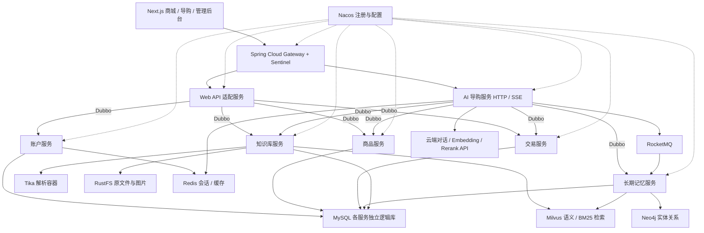

# 比特严选项目书

版本：v0.1 评审稿  
日期：2026-09-27  
目标仓库：https://github.com/yin-bo-Final/Bit-Select  
状态：需求整理与方案建议，尚未进入功能开发。

## 1. 项目目标与边界

构建一个以电子产品和生活用品为主的精选电商平台“比特严选”，并在真实可用的商品、账户、库存、订单系统之上，开发能够理解用户需求、检索商品说明书、记住用户偏好、解释推荐理由的 AI 导购助手。

项目用于本地运行、技术实践和演示。先交付完整商城交易闭环，再交付导购 Agent，最后完成记忆、检索排序与可靠性验证。不能只做静态页面或模拟聊天。

### 已明确的要求

- 前端：Next.js、TypeScript、Ant Design。
- 后端：Java 21、Spring Boot 3、Spring Cloud Gateway、Spring Cloud Alibaba、Sentinel、Spring AI Alibaba、Dubbo。
- 中间件：Nacos、MySQL、Redis、Milvus、RocketMQ、RustFS、Tika，均运行于本机 WSL 内的 Docker 容器。
- Java 业务代码在 Windows 本地 IDEA 中运行；Next.js 在 Windows 本地 Node.js 开发进程中运行，可由 IDEA 启动。
- 微服务通过 Nacos 注册和发现；服务间同步业务调用使用 Dubbo，异步事件使用 RocketMQ。
- 普通用户可直接注册，不增加手机号、短信或验证码流程；登录会话存 Redis，采用七天滑动过期。
- 管理员能够给用户分配演示余额，用户能够购买商品。
- 建立 200 个商品及对应说明书，说明书进入导购知识库。
- Agent 具备短期会话记忆、按用户隔离的长期记忆、混合检索、重排序和带依据的回答。
- 功能使用独立分支开发，提交、推送、创建 PR、运行 CI/CD；检查通过后直接合并。

### 本期建议边界，供评审

- 单商家、自营商城、人民币演示余额，不接入真实支付、不开放提现。
- 包含购物车、收货地址、订单、余额支付、取消订单、模拟发货、确认收货和退款闭环。
- 不包含多商户入驻、优惠券叠加、秒杀、真实物流、发票、复杂营销和真实资金清结算。
- 200 个商品按 200 个 SPU 统计，每个 SPU 至少一个 SKU；不同颜色、规格不重复计为不同 SPU。
- AI 可查询商品、比较商品、解释使用方式、查询本人订单，并在用户明确操作后修改购物车。支付、退款和管理员调账仍走可见的业务确认流程。
- 新增 Neo4j 作为长期记忆的图数据库。这是补齐你提出的图存储需求的建议选型，尚待评审。

单机 Docker 部署可以验证恢复、幂等、故障降级和多实例行为，但不能称为跨机器高可用。本项目不在尚未测试时承诺具体可用率或吞吐量。

## 2. 需要对齐的术语与规则

| 原描述 | 本项目中的解释 | 状态 |
|---|---|---|
| springcloud(sintsitel) | Spring Cloud 体系配合 Sentinel 做流量控制、熔断降级 | 按 Sentinel 理解 |
| mlivus | Milvus 向量数据库 | 统一名称 |
| RFF 模型切块 | 尚未确定具体模型，不能直接当作已有模型接口实现 | 需要名称、论文或链接 |
| RRF | Reciprocal Rank Fusion，融合多路检索排名的算法，不是语义切块模型 | 仅作为检索融合候选 |
| lambdamark | 暂按 LambdaMART 学习排序理解 | 需确认名称 |
| 200K 上下文 | 示例配置；实际使用模型须验证其输入、输出、工具调用等限制 | 不把 200K 当作所有模型固定上限 |
| “前 20%”会话保留 | 原文可能指最早历史；本稿建议保留最近历史，并摘要更早历史 | 必须在实施前确定方向 |

LambdaMART 需要查询、候选文档、相关性标签和训练评估流程，不能仅把 BM25 分数和向量相似度相加后称为 LambdaMART。早期无训练数据时可用 RRF 建立基线，但这不代表原要求中的学习排序已完成。[参考：Milvus 排名融合](https://milvus.io/docs/reranking.md)、[LightGBM 排序目标参数](https://lightgbm.readthedocs.io/en/latest/Parameters.html)。

## 3. 总体架构



图中的业务服务运行在 Windows IDEA；中间件运行在 WSL Docker；模型推理默认调用云 API。CI 内允许临时运行业务服务用于自动化测试，不改变本地开发方式。

### 服务职责与事务边界

| 服务 | 主要职责 | 数据归属 |
|---|---|---|
| gateway | 统一入口、IP 规则、限流、会话校验、路由、请求追踪 | 规则配置，不持有业务数据 |
| web-api | HTTP 与 Dubbo 适配、响应组合、接口参数校验 | 不直接访问其他服务数据库 |
| account-service | 注册登录、用户资料、地址、角色、会话管理 | 用户、地址、角色 |
| catalog-service | 商品、分类、SKU 规格、销售价格、上下架 | 商品主数据、价格版本 |
| trade-service | 购物车、库存、订单、余额、账本、支付、退款 | 所有交易核心数据 |
| ai-service | 会话、短期记忆、提示词、意图路由、工具调用、流式输出 | 会话和消息记录 |
| knowledge-service | 文件入库、解析、切块、索引、文档版本与检索 | 文档、分块、索引任务 |
| memory-service | 长期记忆抽取、消歧、去重、版本、冲突处理与查询 | 用户记忆原文、元数据、图和向量投影 |

**建议将库存、订单和钱包放在同一个交易微服务的不同内部模块中。** 支付时可以用一个 MySQL 本地事务完成扣款、库存确认、订单状态和账本更新，避免为演示项目过早引入跨服务资金事务。整个平台仍然是微服务架构，跨服务调用使用 Dubbo。

此划分是本稿的架构建议。如果要求订单、库存、钱包分别部署为三个服务，需要另行设计 TCC/Saga、资金冻结、库存预留、超时确认和补偿流程，不能用连续三个 Dubbo 调用冒充原子事务。

网关到 Web API、到流式 AI 接口使用 HTTP/SSE；业务服务之间使用 Dubbo。这样不要求 Spring Cloud Gateway 自动理解 Java Dubbo 接口，也不在响应式网关线程中执行阻塞 RPC。

服务使用独立逻辑库与数据库账号。共用本地 MySQL 容器不代表允许跨服务直接读写表；共同代码只放 DTO、RPC 契约、错误码和必要基础能力。

### 网关与服务治理

- 限流维度包含 IP、用户、接口，登录、普通查询、AI 请求分别设置额度。
- IP 来源只信任明确配置的代理，不能直接相信客户端自行填写的转发头。
- Sentinel 规则持久化到 Nacos；Dashboard 用于观察与调整，规则不能仅存在控制台内存。
- 服务端重新校验用户身份与资源权限；网关移除客户端伪造的内部身份头。
- Dubbo 设置超时、并发上限与熔断策略。写请求不做无条件自动重试，重试必须带业务幂等键。
- AI 故障不应阻止商城浏览和正常交易；展示明确的降级状态。

## 4. 商城业务规则

### 4.1 注册与登录

- 使用用户名和密码注册，用户名唯一，密码使用成熟单向密码哈希算法存储。
- 按你的要求不增加短信、手机号和验证码。基础参数校验、密码哈希和权限校验仍保留。
- 登录生成不可预测的随机会话凭证，Redis 保存会话状态；建议 Redis 使用凭证摘要作为查询键。
- 浏览器通过 HttpOnly Cookie 持有凭证；生产 HTTPS 使用 Secure，配置 SameSite 和写请求 CSRF 防护。
- 初始 TTL 为 7 天，即 604800 秒。
- 本稿将“再次登录/访问”解释为有效的用户登录或已认证业务活动：成功校验后重新计算七天 TTL，同时更新浏览器 Cookie 的有效期。
- 自动轮询、心跳和后台保活不应无限延续闲置会话。哪些接口续期形成明确白名单。
- 连续七天无有效活动，会话失效，需重新输入密码。Redis 已过期的会话不能仅凭旧 Cookie 重新生成。
- 注销立即撤销会话；修改密码、禁用账号、撤销管理员权限支持主动失效。
- Redis 不可用时，受保护操作不能绕过认证；返回可重试错误，不将用户错误地识别为已登录。

建议默认允许多个设备会话独立存在；后台可撤销指定会话或用户全部会话。是否改为单设备登录可在评审时调整。

### 4.2 余额与管理员

- 用户初始余额为 0，金额使用整数“分”存储和运算，禁止浮点金额。
- 管理员通过“分配余额”操作增加用户演示余额，须填写金额和原因。
- 余额调整必须有操作者、用户、业务流水号、前后余额、时间、原因和幂等键。
- 采用不可直接覆盖的账本流水，余额与账本在同一个事务内更新；错误调整以冲正流水处理。
- 默认只开放增加余额；管理员扣减余额不自动纳入首期范围。
- 管理员通过一次性初始化方式创建，初始密码从本地配置读取，不在仓库硬编码。
- 普通用户不能通过修改接口参数、角色字段或请求头进入管理员能力。

### 4.3 库存、订单和余额支付

建议流程：选择商品 → 加入购物车 → 服务端生成报价 → 确认订单并预留库存 → 余额支付 → 待发货 → 模拟发货 → 收货完成。

交易规则：

1. 商品价格、数量上限、上下架状态由服务端校验，不采用浏览器传来的金额。
2. 报价包含服务端签发的编号、价格版本、有效期和商品明细；提交时校验，价格变化按明确规则重新确认。
3. 订单保存商品名称、SKU 规格、成交价格、地址和相关版本快照，历史订单不随商品编辑变化。
4. 库存区分可用、预留和已售；创建订单时以条件更新预留库存，受影响行数决定是否成功。
5. 支付在同一数据库事务内完成余额条件扣减、支付账本、库存确认、订单状态迁移及 Outbox 事件写入。
6. 对订单号、支付流水号、退款流水号和幂等键建立唯一约束，重复请求返回同一业务结果。
7. 同时支付和取消同一订单时，通过行锁或版本条件更新串行化状态迁移，不能既支付成功又释放同一库存。
8. 未支付订单默认 15 分钟到期。RocketMQ 定时/延时能力触发关闭，同时提供数据库扫描补偿；不只依赖一条消息。
9. 订单关闭释放预留库存。任务重复执行也只释放一次。
10. 退款在确认符合业务状态后，原子更新退款账本、余额和订单退款状态；退货库存仅在确认退货入库后恢复。

订单与退款分开建状态机。订单主流程为待支付、待发货、已发货、已完成、已关闭；退款单为申请中、已批准、待退货、退款成功、已拒绝等适用状态。首期支持整单退款，部分退款后续再扩展。

未发货已支付订单可走取消并退款；已发货订单需要管理员确认退货处理，再退演示余额。模拟物流也必须对应真实状态变化，不能只是页面按钮动画。

### 4.4 一致性与故障恢复

- MySQL 是金额、订单、库存的事实来源；Redis 只做缓存和加速。
- 数据库事务内写 Outbox，后台投递 RocketMQ；消费端按事件 ID 去重，采用可重复消费设计。
- 不声称消息队列提供端到端“恰好一次”。业务唯一约束和幂等处理负责抵御重复投递。
- MQ 暂停时，已提交交易仍可保留待发送事件，恢复后重放。消息积压需可见并告警。
- 客户端超时后通过业务请求号查询结果；不得因为超时就重新扣款。
- 提供订单、库存预留、钱包账本的对账任务及差异报告。
- 查询缓存提交后失效并有兜底 TTL；关键写请求重新检查数据库状态。

## 5. 200 个商品与说明书

### 5.1 品类与数量建议

| 一级品类 | 商品数 | 示例方向 |
|---|---:|---|
| 数码配件 | 40 | 充电器、数据线、扩展坞、移动电源、支架 |
| 电脑与办公 | 35 | 键鼠、桌垫、显示器支架、办公照明 |
| 音频与智能设备 | 25 | 耳机、音箱、智能插座、传感器 |
| 生活小家电 | 35 | 风扇、加湿器、清洁电器、个护小电器 |
| 厨房与餐饮用品 | 35 | 锅具、餐具、水杯、厨房收纳 |
| 家居与出行用品 | 30 | 家纺、收纳、背包、旅行配件 |
| 合计 | 200 | 品类集中，每类具备可比较的不同产品 |

### 5.2 商品数据标准

每个 SPU 具有唯一编号、名称、分类、卖点、参数、适用人群、使用场景、限制条件、价格、SKU、库存、主图和对应说明书。至少提供一张与商品一致的主图，推荐补充细节或场景图。

说明书至少包括：产品概述、规格与兼容性、包装清单、安装/使用步骤、保养方法、注意事项、故障排查、FAQ、演示售后规则、文档版本及来源标识。

先形成结构化商品事实表，再据此生成商品页面和说明书，防止商品规格、图片描述与手册相互矛盾。额定功率、容量、接口、尺寸等关键参数以事实表为准。

### 5.3 素材与真实性

- 参考京东京造的精选品类思路，不直接复制其品牌身份、页面和整套商品文案。
- 采用原创演示商品及原创说明书，结合具有可用授权的素材；记录来源 URL、作者或授权方式、获取时间。
- 真实品牌说明书仅在来源、使用条件和商品型号对应关系明确时纳入，不把真实手册改标题后冒充原创商品说明。
- AI 生成图片和原创虚构规格明确作为演示数据，不虚构第三方认证、真实销量和用户评价。
- 200 份手册必须全部完成解析与索引并能追溯版本；不能仅将文件上传后便标记知识库建设完成。

## 6. 导购 Agent 能力与边界

主要场景：需求澄清、按预算推荐、商品比较、规格兼容性问答、说明书问答、使用故障排查、本人订单查询、演示售后说明。

示例：“预算 300 元，给宿舍买个安静的风扇”，应能提取预算与场景，必要时询问尺寸和噪音偏好，检索候选商品及手册，再展示推荐理由、差异和对应依据。

采用显式、可观测的工作流：会话鉴权 → 上下文准备 → 问题重写 → 意图识别 → 路由检索或业务工具 → 事实与冲突检查 → 流式回答 → 异步记忆事件。

- 商品说明、使用方法来自有引用的知识库材料。
- 价格、库存、余额和订单状态通过业务工具实时查询，不从旧说明书或记忆推断。
- 工具只接收后端校验后的结构化参数；用户身份来自认证上下文，不能让模型自由指定 userId。
- 无依据时说明未知或继续提问，不编造参数、库存、售后承诺和订单状态。
- 文档、检索片段与工具返回内容均当作数据，不能覆盖系统指令、权限或支付流程。
- 限制工具调用次数、单轮耗时、输入输出 Token 和用户请求额度，支持取消与超时。
- 只读工具可按策略重试；购物车等写工具必须幂等。AI 不开放管理员分配余额工具。
- 流式断线重连不重复执行写工具，利用会话请求号和已执行工具记录恢复。

## 7. 短期记忆与压缩

### 7.1 数据与预算

完整消息记录存 MySQL；Redis 缓存活跃会话、摘要版本和近期消息。历史消息保留与“本轮送入模型的上下文”分离，压缩不会删除原始审计记录。

设模型已验证的上下文容量为 C。触发阈值为 0.60 × C，原文保留窗口目标为 0.20 × C。若 C = 200,000，则分别为 120,000 和 40,000 Token。

Token 预算包含系统提示词、工具定义、历史摘要、消息、工具结果、检索证据，并预留最大输出和安全余量；模型单独限制输入长度时同样执行该限制。使用适合模型的计数方式，不能简单按中文字符数除以常数认定精确值。

在构建本次完整输入时预检；检索补入证据或工具返回后再次检查，防止只压缩历史却被超长工具结果撑爆上下文。

### 7.2 窗口方向待评审

你原文的字面方案：保留最早的约 7.4 轮，向完整轮次扩展到第 8 轮，即保留最早 16 条消息，摘要其余 24 条消息。

本稿的建议方案：从最新消息向前取约 40,000 Token；若边界落在一轮中间，则纳入整轮。假设这对应最近约 7.4 轮，则保留最近 8 轮，即最后 16 条消息，将前 12 轮、24 条消息摘要。

推荐后者，因为当前任务通常依赖最近对话。**这属于明确提出的需求调整，尚未认定你已同意。** 两种方向可设计为配置策略，但默认方向必须在开发压缩功能前确认。

轮数只用于说明边界，不用于计算 Token。不能从 40 条消息直接推算其 Token 占比。实际一轮可能包含多个工具调用和结果，必须整体保留，不能留下无对应结果的工具请求。

### 7.3 摘要与异常处理

- 摘要保留用户目标、硬性约束、已确认事实、选择和否定、未解决问题、必要工具结果及可追溯消息范围。
- 已有摘要与本次被移出窗口的历史增量合并，记录覆盖范围和版本，防止遗漏或重复压缩。
- 摘要有独立 Token 上限；压缩后重新计数，避免无限累加摘要。
- 当前未完成的一轮、系统指令和关键安全约束不能被随意丢弃。
- 完整轮次扩展可以超过 20% 的目标，但不得超过模型硬限制。单轮本身过大时先压缩工具输出，再采用有标识的分层摘要或要求缩小输入。
- 摘要失败保留原文，不覆盖成功版本；如果原文无法放入模型，返回可恢复提示，而不是发送超限请求。
- 同一会话消息追加与摘要替换使用序号、版本校验或会话锁，避免并发请求覆盖最新消息。

验收覆盖：刚好触达阈值、7.4 轮边界、含工具调用的轮次、超长单轮、摘要失败、多次压缩和并发发送。

## 8. 长期记忆

### 8.1 记忆内容与用户隔离

长期记忆保存 Agent 对用户的理解，如预算偏好、已有设备、使用场景、明确喜欢或排斥的特点。临时订单状态、余额、一次性问题不当作稳定偏好。

所有记忆查询、更新、向量检索、图遍历和后台任务均绑定服务端认证产生的 userId。向量检索前应用用户过滤条件，不能先检索所有用户再由模型判断。图节点和关系同样具有用户归属，禁止跨用户路径扩展。

用户应能查看、更正、删除个人记忆并关闭后续记忆提取。删除包含数据库原文、向量、图投影及相关缓存，后台任务必须识别删除版本，防止旧消息重放后恢复已删除记忆。

### 8.2 异步写入链路

会话完成 → MySQL 保存消息与待提取事件 → Outbox 投递 RocketMQ → 提取候选事实 → 语义查重和实体消歧 → MySQL 保存记忆版本 → 异步更新 Milvus 与 Neo4j → 标记投影状态。

MQ 事件携带事件 ID、用户 ID、会话 ID、消息范围与版本，避免无必要地重复传播完整私密文本。三种数据库不存在天然的共同事务，采用 MySQL 权威记录、幂等投影、失败重试和可重建索引实现最终一致。

### 8.3 存储结构

| 存储 | 内容 |
|---|---|
| MySQL | 原始消息/记忆原文、结构化事实、来源、置信度、时间、版本、有效状态、索引状态 |
| Milvus | 记忆语义片段向量、memoryId、userId、模型版本和有效性字段 |
| Neo4j | 用户拥有设备、偏好品类、设备适配等关系，带来源、时间、用户归属 |
| RustFS | 如涉及附件，保存原始二进制文件；MySQL 保存抽取的规范文本及对象引用 |

### 8.4 去重、消歧与冲突

- 写入前检索同用户、同类记忆的近邻，以可配置阈值寻找候选；阈值需要评测，不能把固定数值宣称为通用正确值。
- 高语义相似不等于事实相同。例如“预算 300 元”和“预算 3000 元”必须进行实体、属性、单位与数值比较。
- 同一事实新增证据或重复表达，更新同一记忆；确有变化时追加新版本，保留旧版本和来源，按适用时间替代。
- 同一实体按规范名称、别名、型号、SKU 等消歧，同用户作用域内合并；“两副同型号耳机”仍可能是不同实际设备。
- 图关系更新也需要冲突和有效期处理，不能只更新节点属性却留下相互矛盾的旧边。
- 模糊候选不能强行合并，保留待确认状态。

送入模型前，先以实体、属性、时间、场景判断是否真正冲突，再比较证据。当前明确陈述优先于旧推断；相同可信程度下近期事实优先于旧事实；不同场景的预算可以同时成立。

交易实时事实始终以业务服务为准。仍无法解决的冲突由助手向用户确认，不能把两个矛盾事实直接拼到提示词里。

### 8.5 长期记忆混合读取

根据当前问题提取实体与需求，在 userId 过滤下分别执行 Milvus 语义召回、Neo4j 有界关系查询，以及 MySQL 的有效期和结构化属性查询。图查询限制跳数与返回量，不对整张用户图无边界展开。

各路结果通过 memoryId、实体和事实属性合并，回查 MySQL 当前有效版本，剔除已删除、失效或尚未发布的投影。综合语义相关性、关系匹配、来源置信度与时效进行排序，再执行冲突检测。

只把与当前任务相关且满足独立 Token 预算的记忆注入上下文，并带上来源时间。图库暂不可用时可降级到语义和结构化查询，不能捏造关系结果；新记忆的投影尚未完成时，可从近期 MySQL 有效记录补充。

## 9. 商品知识库与检索排序

### 9.1 文档入库链路

原文件上传 RustFS → 创建 MySQL 文档版本与任务 → RocketMQ 异步处理 → Tika 解析 → Java 二次结构化清洗 → 语义切块 → 边界扩展 → Embedding → Milvus 索引 → 验证完成后发布。

Tika 负责提取文本和元数据；二次解析负责标题层级、段落、参数表、列表、页眉页脚、单位规范化与商品映射。不能把所有内容压成一段后丢失型号和表头。

扫描 PDF 若无文本层，需另配 OCR。本期优先生成可解析的文本型说明书；出现扫描材料时标记“待 OCR”，不把空文本任务报为成功。

每个分块保留 productId、documentId、version、chunkId、标题路径、页码或可用位置、原文偏移、内容哈希、来源和模型版本。新版成功后切换有效版本，旧版不继续作为现行证据召回。

### 9.2 语义切块建议

在 RFF 具体模型未确认前，建议采用“标题和段落结构初分 + 相邻段落 Embedding 相似度确定语义边界”的方案，并保留可替换的 Chunker 接口。

候选目标块长为 600-1000 Token，由评测调整。每个核心块在两端各向相邻文本扩展最多 200 Token，即本稿将“边缘延伸 200 Token”解释为前后各 200；文档端点不补齐。参数表与警示段优先整体保留。

核心范围和扩展范围分别记录，检索后去除重复证据。扩展后的总长度必须满足 Embedding 和 Rerank 的单条输入限制；不能用静默截断破坏关键参数。

若你提供指定 RFF 模型，先验证输入输出、授权、推理资源与切块质量，再替换建议实现。RRF 排名融合不代替这一步。

### 9.3 在线检索链路

1. 问题重写：结合本轮上下文消解“它”“刚才那款”，保留预算、型号和否定约束，保留原问题用于检查。
2. 意图识别：区分商品推荐、比较、说明书问答、订单、余额、售后和无关问题，选择检索或业务工具。
3. 多路召回：Milvus 稠密向量按 COSINE 召回 Top 10；BM25 按关键词召回 Top 10。默认每路 10，而不是两路合起来只取 10。
4. 合并候选：按分块 ID 和文档版本去重，应用商品、文档有效性和权限过滤。只有召回结果没有交集时才可能有 20 个候选。
5. Rerank 模型：对问题与每个候选证据计算相关性分数。
6. LambdaMART：输入 BM25 分数/排名、余弦分数/排名、Rerank 分数、型号匹配、品类匹配等特征，输出最终排序。
7. 选择 Top K：默认 K = 5，可按任务和 Token 预算调整，同时合并重复片段并检查证据覆盖。
8. 生成答案：引用商品和说明书位置；涉及价格、库存时补充实时业务查询。

Milvus 官方提供 BM25 全文检索能力，因此本期可优先在 Milvus 内实现稀疏与稠密检索，减少增加额外搜索引擎的必要；具体版本和中文分词配置需在初始化阶段验证。[参考：Milvus 全文检索](https://milvus.io/docs/full-text-search.md)。

### 9.4 LambdaMART 交付要求

- 建立查询、候选片段和 0-3 等级相关性标签的数据集，包含预算、型号、兼容性、否定表达与跨品类问题。
- 初始建议至少准备 200 条人工复核查询和对应候选标注，用作起点，不将该数量视为质量保证。
- 训练、验证、测试按查询及必要的商品分组隔离，避免同一问题改写泄漏到测试集。
- 可用 LightGBM 的排序目标做离线训练，模型制品与特征定义版本化；Java 在线服务通过经过验证的推理适配器加载，必要时采用 WSL Docker 内的模型服务。
- 比较向量、BM25、RRF、Rerank、LambdaMART 的 Recall@10、NDCG@5 和回答依据质量。
- 没有训练制品或评测不合格时，以有明确标识的基线模式运行，并保留未完成项，不把占位分数算作学习排序交付。

## 10. 提示词与配置解耦

建议统一维护版本化提示词目录：

```text
prompts/
  agent/system.md
  conversation/summarize.md
  retrieval/rewrite-query.md
  retrieval/classify-intent.md
  retrieval/answer-with-evidence.md
  memory/extract-facts.md
  memory/resolve-entities.md
  memory/check-conflicts.md
  catalog/generate-manual.md
```

每份提示词定义输入变量、输出结构、未知信息处理与样例。提示词修改具有独立版本和评测记录，不散落在 Java 字符串内。模型输出必须进行结构和业务校验。

模型、上下文上限、摘要阈值、保留比例、召回数量、Token 预算、重排开关、记忆阈值均为配置。API Key 使用环境变量或密钥存储，不写入提示词、Git、浏览器包和日志。

## 11. 前端产品与设计

设计理解：面向日常消费者的精选电商，采用简洁可信、商品优先的视觉语言，以 Ant Design 为唯一主组件体系。

应用你指定的 design-taste-frontend skill：商城首页和品牌展示遵循其排版、留白、视觉一致性与完整交互状态要求。该 skill 明确不覆盖后台密集表格和多步骤表单，这些页面使用 Ant Design 的成熟交互模式，不生搬营销页动效。

建议设计参数：DESIGN_VARIANCE = 5、MOTION_INTENSITY = 3、VISUAL_DENSITY = 5。使用银灰中性色、近黑正文和一种克制的品牌强调色；支持一致的明暗主题和减少动态效果设置。最终颜色随品牌视觉评审确定。

| 页面组 | 页面与能力 |
|---|---|
| 商城 | 首页、分类、商品搜索、筛选、详情、参数比较、说明书查看 |
| 用户 | 注册、登录、地址、余额流水、购物车、结算、订单与售后 |
| 导购 | 流式会话、推荐商品、比较结果、证据引用、历史会话 |
| 个人记忆 | 查看偏好、更正或删除记忆、关闭长期记忆 |
| 管理后台 | 商品/SKU、库存、订单、余额分配、手册与索引任务 |
| AI 调试后台 | 检索路径、召回/排序分数、上下文用量、摘要版本、记忆任务状态 |

普通用户看到“正在查找资料”“根据哪份说明书推荐”等有用状态；后台可看到 Token、召回评分、队列状态、冲突消解结果和调用耗时。只展示可审计的执行记录，不展示或伪造模型私有思维链。

页面必须具备加载、空结果、异常、权限不足、过期、断线、取消和成功状态。商品图与信息一致，价格和库存来自后端。桌面和移动端都能完成注册、购物与导购流程。

## 12. 本地环境与容器规划

### 运行位置

| 位置 | 内容 |
|---|---|
| Windows | Git、IDEA、JDK 21、Node.js、前端开发服务、Java 微服务 |
| WSL Docker | MySQL、Redis、Nacos、Sentinel Dashboard、RocketMQ、RustFS、Milvus 及依赖、Neo4j、Tika |
| 云端 | 对话、Embedding、Rerank API；可选图片生成 API |

Milvus standalone 所需的 etcd、对象存储等依赖随锁定版本部署。RustFS 可作为候选 S3 存储后端，但需做连接、上传、索引、重启恢复测试后确定，不能仅凭“S3 兼容”认定任意组合可用。商品附件和 Milvus 对象应分桶、分凭据管理。

RocketMQ 的 NameServer、Broker 和所选客户端需要的 Proxy 按版本配套；对外公告地址必须能从 Windows 访问。Nacos 注册的 IDEA 服务地址也必须能被其他消费者访问，不能误报容器内网 IP。

容器管理包括固定镜像版本、健康检查、启动依赖、资源限制、命名卷、初始化脚本、日志轮转、备份与恢复。数据卷放在 WSL Linux 文件系统，避免将高频数据库数据直接放在 Windows 挂载目录。

### 资源预算建议

完整启动包含多个 JVM 与数据库。建议先按 32 GB 内存机器制定受限堆大小与分组启动方案；48-64 GB 可提供更多 IDE、索引和测试余量。预留约 80-120 GB 可用磁盘用于镜像、数据和构建缓存。这些是规划估算，最终依据本机配置和实测收敛。

默认使用云模型 API，因此本地不要求 GPU。若指定本地大模型、重排模型或 RFF 模型，再根据模型规模单独核算显存与内存。

### 版本管理

保留 Java 21 和 Spring Boot 3 的硬约束，在初始化阶段根据 Spring Cloud、Spring Cloud Alibaba、Spring AI Alibaba、Dubbo、Nacos 的官方兼容说明锁定版本，并提交 BOM 与依赖锁定结果。不要把每个组件的独立最新版随意组合。[参考：Spring AI Alibaba 兼容说明](https://java2ai.com/en/docs/1.0.0.2/faq/)。

## 13. 分支、提交、PR 与 CI/CD

你已授权功能开发完成后提交、推送、创建 PR，并在检查通过后直接合并。评审通过后的开发沿用该授权，无需每个正常功能重复申请。

### 分支流程

1. 开发一个功能前，获取远程最新默认分支并更新本地基线。
2. 从该基线创建功能分支，例如 feat/redis-session、feat/order-payment、feat/agent-memory。
3. 在该分支开发、执行本地验证、提交并推送。
4. 创建中文 PR 正文，描述问题、最终行为、测试、数据变更和回退方法。
5. 运行并等待必需 CI 检查；失败则在同分支修复，重新执行。
6. 确认当前待合并提交与已通过检查的提交一致；有冲突或基线变化时重新验证合并结果。
7. 必需检查全通过且无阻塞后，直接合并。合并后的默认分支继续运行发布流水线；失败则修复或回退，并报告。

“每完成一个功能才切分支”容易使功能混进默认分支，因此这里按你的隔离意图整理为“每个功能开始前新建分支，完成后提交和合并”。实际默认分支名称以仓库为准，不预先假定。

### 标题与语言

Commit 与 PR 标题统一为：`type:English summary/中文摘要`。

示例：

- `feat:add sliding login sessions/实现滑动续期登录会话`
- `fix:prevent duplicate wallet charges/修复钱包重复扣款`
- `docs:add project proposal/补充项目书`
- `ci:add integration checks/增加集成检查`

type 按实际用途选 feat、fix、docs、refactor、test、ci、chore 等；英文和中文表达同一意思，不把所有新功能都标为 fix。PR 正文统一中文，Squash 合并标题沿用同样格式。

### CI/CD 门禁

- 基础检查：前端类型、规范与构建；后端编译、测试；迁移脚本与配置校验；意外密钥扫描。
- 集成检查：使用独立测试数据库和容器，验证 Redis 会话、Dubbo/Nacos、交易并发、RocketMQ 重试与幂等、文件解析和索引链路。
- 端到端检查：注册 → 管理员分配余额 → 下单支付 → 查看订单；导购 → 商品证据 → 商品详情。
- AI 测试分层：常规 PR 使用可重复的模型替身测试流程；涉及模型、提示词和检索的功能还要执行真实模型评测并保存报告，替身通过不等于真实 AI 能力通过。
- 完整中间件测试可放在专用较大 Runner；不为了得到绿色状态而跳过未配置的必需检查。
- 合并后产出前后端构建物、镜像或部署包、版本及迁移记录。CD 的实际部署目标待确定，默认不覆盖用户当前 IDEA 运行进程，也不自动发布公网服务。

本地 WSL 默认不能被 GitHub 托管 Runner 直接访问。若使用本机 self-hosted Runner，需明确执行范围和本地资源占用；CI 数据与日常演示数据隔离。

仓库写权限、Actions 是否启用、分支规则和 Runner 可用性尚未核验。若平台权限或必需检查阻塞合并，应报告真实阻塞，不绕过规则或把“未运行”写成“已通过”。

## 14. 交付阶段与验收

| 阶段 | 主要成果 | 通过条件 |
|---|---|---|
| A. 方案确认 | 项目书、待确认决策、模型和资源配置 | 关键歧义确定，环境前提具备 |
| B. 工程与环境 | 仓库结构、兼容版本、Compose、CI、IDEA 启动配置 | Windows 与 WSL 双向访问、健康检查、基础 CI 通过 |
| C. 账户与商品 | 登录、角色、地址、商品与库存管理、商城页面 | 七天 TTL 可控时钟验证、权限隔离、真实接口联调 |
| D. 交易闭环 | 购物车、报价、下单、余额、账本、支付、退款 | 不超卖、不透支、不重复扣款，重复消息不重复执行 |
| E. 商品内容 | 200 SPU、图片、200 份对应说明书 | 数量、字段、型号、来源与说明书一致性检查通过 |
| F. 知识库 | Tika、结构解析、语义切块、Milvus 索引 | 200 份文档可检索，证据可定位，失败任务可重放 |
| G. 导购与短期记忆 | 流式导购、工具、改写、意图、摘要窗口 | 推荐有依据，压缩不拆轮、不超限，写操作幂等 |
| H. 长期记忆 | MQ、MySQL、Milvus、Neo4j、消歧与冲突 | 用户隔离、重复更新、事实变更、删除与恢复测试通过 |
| I. 学习排序 | 标注集、训练制品、特征版本、排序评估 | LambdaMART 实际运行，有与基线对比的独立测试报告 |
| J. 完整验收 | 响应式体验、并发和故障演练、运维文档 | CI/CD 记录完整，主要故障可恢复，已知限制可见 |

### 重点测试

- 100 个并发请求购买仅剩 1 件商品，最多一个有效库存预留成功；失效订单最终释放预留。
- 同一用户并发支付不同订单，不出现负余额；同一订单重复请求不重复扣款。
- 支付与超时关闭竞争，最终订单、账本和库存一致。
- 重复分配余额、重复退款、消息重放不产生重复资金变化。
- Redis 会话在第七天边界前后正确续期与失效，不实际等待七天测试。
- 用户 A 不能通过猜测 ID、提示词、向量检索或图查询读到用户 B 的会话、订单、记忆。
- 杀停 MQ、索引服务或重启消费者后，待处理任务可重试并收敛；已删除记忆不会复活。
- 说明书更新后只引用当前有效版本；Embedding 模型或维度变更必须新建索引并重建，不能混用。
- AI API 超时、限流、返回无效结构时可降级，商城交易不受连带阻塞。

性能验收必须记录硬件、数据规模、并发、缓存状态、模型和网络。初始化阶段建立基线后，确定普通接口 P95、错误率、AI 首字延迟和检索质量的具体目标，避免写出无测量条件的“高性能”。

## 15. 你需要准备的内容

### 15.1 模型与 API 能力

| 能力 | 是否必需 | 建议候选 | 用途 |
|---|---|---|---|
| 对话与工具调用 | 必需 | 百炼 qwen-plus 系列，锁定实际可用版本 | 导购、问题改写、意图识别、摘要、记忆抽取和冲突判断 |
| 文本 Embedding | 必需 | text-embedding-v4 | 商品知识库、用户记忆、语义边界计算 |
| 文本 Rerank | 必需 | 所选地域可用的 qwen3-rerank 或 gte-rerank-v2 | 候选证据重排序 |
| 图片生成 | 可选 | 后续按素材方案确定 | 原创商品示意图和场景图 |
| OCR | 条件必需 | 有扫描版手册时选择 OCR 服务或本地组件 | 扫描 PDF、图片文本提取 |
| 指定 RFF 模型 | 待确认 | 请提供准确名称或链接 | 判断是否确为语义切块模型 |
| LambdaMART | 无需普通聊天 API Key | 离线训练并部署排序制品 | 混合特征学习排序 |

建议先用同一百炼账号下的对话、Embedding 和 Rerank 能力，减少接入复杂度。它们可能共享账号密钥，也可能因地域、工作空间和权限使用不同配置，不能只提供一个 Key 就认定三类接口均可调用。

当前官方文档提供 qwen-plus、text-embedding-v4 及文本排序接口说明；最终以你账号实际开放的模型和地域为准，不能根据模型别名直接假设其上下文永远不变。Embedding 建议先选定一种维度，例如 1024，连同模型版本一起固定并实测。[对话模型](https://help.aliyun.com/zh/model-studio/qwen-plus)、[Embedding 模型](https://help.aliyun.com/zh/model-studio/text-embedding-v4)、[Rerank 接口](https://help.aliyun.com/zh/model-studio/text-rerank-api)。

### 15.2 请提供的非敏感信息

1. 模型供应商、地域、工作空间（如适用）、准确模型 ID、各能力的 API Base URL。
2. 对话模型输入/输出限制、是否支持工具调用、流式与结构化输出；Embedding 维度；Rerank 单次候选和文本长度限制。
3. 账号可用额度、并发限制及希望控制的日/月预算。
4. 本机 CPU、内存、磁盘余量、WSL 发行版，以及当前 Docker 的运行方式。
5. GitHub 登录状态和本仓库写入/合并权限，Actions 是否可用。
6. 初始管理员用户名；密码通过本地私密配置填写。
7. 商品素材倾向：原创演示商品，或有明确使用权限的真实商品资料。

这些环境信息可在后续由我执行只读检查，你不需要手工整理所有版本或预先创建容器。

### 15.3 密钥提供方式

密钥不必粘贴到聊天或项目书。评审通过后，我会创建仅含变量名的示例配置，你在被 Git 忽略的本地环境文件或 IDEA 环境变量中填写真实值，例如 CHAT_API_KEY、EMBEDDING_API_KEY、RERANK_API_KEY。模型服务在后端读取，前端不可访问。

本地开发密钥与 CI 密钥分开管理；如真实模型评测需要 CI 调用，再配置对应 GitHub Secrets。调试日志、错误响应和截图不得输出完整密钥。

## 16. 评审决策清单

| 决策 | 本稿建议 | 是否需要你的明确选择 |
|---|---|---|
| 短期记忆保留方向 | 最近完整轮次保留，较早历史摘要 | 是，与你原文可能不同 |
| RFF 指代 | 若无指定模型，采用结构与 Embedding 语义切块 | 是，需确认模型或接受替代 |
| lambdamark 指代 | LambdaMART，列入完整交付；无数据阶段用标明的基线 | 是，需确认名称 |
| 图数据库 | Neo4j，运行于 WSL Docker | 可随项目书整体确认 |
| 交易服务边界 | 钱包、库存、订单在同一交易服务内保证本地事务 | 可随项目书整体确认 |
| 七天续期行为 | 有效登录/已认证业务活动续期，后台心跳不续期 | 可随项目书整体确认 |
| 商品与素材 | 六大类 200 SPU，原创演示商品与手册 | 可随项目书整体确认 |
| 业务范围 | 演示余额、模拟物流、整单退款，无真实支付 | 可随项目书整体确认 |
| 模型 | 优先百炼对话 + Embedding + Rerank | 依据你的账号与预算确认 |
| CD 目标 | 先构建和验证部署包，实际部署环境另行明确 | 部署前需确定目标 |

## 17. 当前执行状态

已完成：整理原始需求、查阅关键技术官方资料、检查本地工作目录、查看目标仓库公开页面、阅读指定前端设计 skill、输出本评审稿。

目前本地工作目录原为空目录，尚未初始化或克隆 Git；远程仓库公开页面仅显示 README。未创建中间件容器、未创建功能分支、未写业务代码、未调用付费模型，也未宣称运行过 CI/CD。本轮交付用于你评审方案，正式开发从评审后的工程初始化开始。

参考技能文件：[design-taste-frontend](C:/Users/35575/.agents/skills/design-taste-frontend/SKILL.md)。该技能只约束适用的前端设计部分，不改变你明确指定的 Next.js、TypeScript 和 Ant Design 技术栈。
